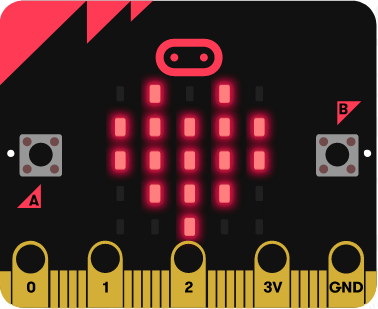
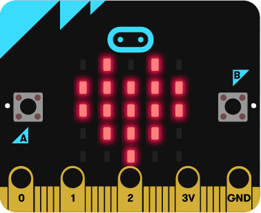
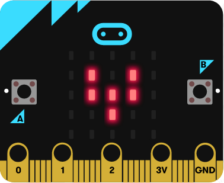
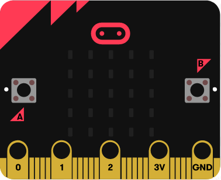
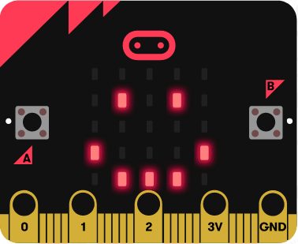
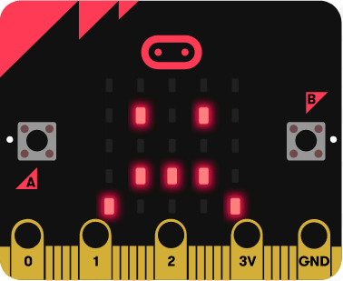
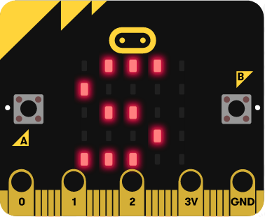
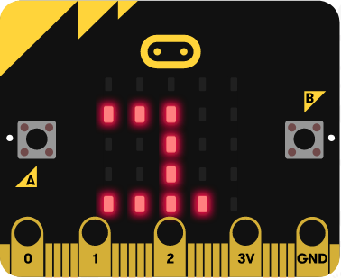
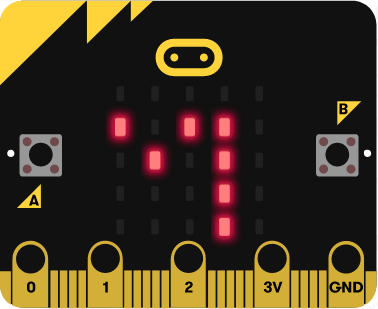
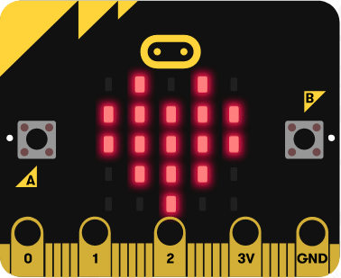

```{r set_up, include=FALSE}
knitr::opts_chunk$set(echo=TRUE, message=FALSE, warning=FALSE)
```

```{r klippy, echo=FALSE, include=TRUE}
# install.packages("remotes")
# remotes::install_github("rlesur/klippy")
# klippy::klippy()
klippy::klippy(c('r', 'python'))
```

```{r, message=FALSE, warning=FALSE, include=FALSE}
packages = c('reticulate', 'rmdformats')

package.check <- lapply(
  packages,
  FUN = function(x) {
    if (!require(x, character.only = TRUE)) {
      install.packages(x, dependencies = TRUE)
      library(x, character.only = TRUE)
    }
  }
)
```

```{css, echo=FALSE}
/*Adjusts klippy icon colors to make them visible when using a specific template.*/
img > .octicon::after, ::before{
background-color: #ffffff !important;
}

button > .btn-klippy, .tooltipped, .tooltipped-no-delay, .tooltipped-e{
background-color: #ffffff !important;
}
```

<!--Important url hyperlinks-->

<a href="https://github.com/Gerardo-Pelayo-Garcia/code-and-robotics/" target="_blank">Github</a>
\ \ \ \ \ 
<a href="http://u.pc.cd/yDjctalK" target="_blank">PCloud</a>
\ \ \ \ \ 
<a href="https://makecode.microbit.org/" target="_blank">Micro:Bit</a>
\ \ \ \ \ 
<a href="https://repl.it/" target="_blank">Repl.It</a>
\ \ \ \ \ 
<a href="https://projecteuler.net/archives" target="_blank">Project Euler</a>


Lorem ipsum dolor sit amet, consectetur adipiscing elit. Integer sollicitudin mauris mi, sed faucibus ex lacinia id. In volutpat orci in molestie lacinia. Praesent a egestas nibh. Nulla tristique ultrices consectetur. Interdum et malesuada fames ac ante ipsum primis in faucibus. Donec euismod finibus tellus, ut efficitur enim vestibulum vitae. Praesent tempus, erat id lacinia scelerisque, tellus felis congue metus, id laoreet orci metus dictum orci. Vivamus scelerisque sit amet nulla vitae tempor. Morbi non elit vel libero vehicula accumsan quis eu risus. Fusce euismod placerat orci, ut tempus sem dictum in. Maecenas pulvinar ligula in risus posuere semper. Ut pretium eros nulla, nec sollicitudin lacus dictum id. Nullam finibus leo ante, nec consequat diam vestibulum vel. Sed in mattis mauris. Nam eu sem eu nulla viverra tincidunt.

Proin eu arcu pulvinar, accumsan metus dapibus, elementum sem. Morbi vulputate congue erat, non suscipit ante faucibus ut. Aenean elit ligula, mollis ac ipsum at, blandit dapibus felis. Nunc nec varius enim. Nullam id ligula vehicula, auctor arcu ut, viverra leo. Maecenas ultrices hendrerit sapien, ac ultrices eros maximus id. Ut pellentesque vehicula molestie. Praesent ultrices dolor id massa posuere elementum. Quisque ultricies dolor non facilisis placerat. Aenean vitae hendrerit justo, eget tempus mi. Cras pretium dapibus leo, ornare rhoncus ligula ullamcorper eget. Suspendisse fermentum nisi nisi, a faucibus augue sagittis quis. Vestibulum ante ipsum primis in faucibus orci luctus et ultrices posuere cubilia curae; 

</br><hr></br>

# MICRO:BIT

> The BBC micro:bit is a pocket-sized computer that introduces you to how software and hardware work together. It has an LED light display, buttons, sensors and many input/output features that you can program and physically interact with. The latest micro:bit adds sound sensing and playback capabilities.
>
> <a href="https://support.microbit.org/support/solutions/articles/19000013983-what-is-a-micro-bit-" target="_blank"><em>Read more</em></a>


## 1. Introduction

Go to makecode.microbit.org.

Connect the Micro:Bit to your computer if you are not only using the online emulator.
<a href="https://support.microbit.org/support/solutions/articles/19000013984-how-do-i-connect-the-micro-bit-to-my-computer" target="_blank">instructions</a>

Follow the directions to either run your code on the makecode website or flash the program to the physical Micro:Bit. Do not disconnect the Micro:Bit from your computer while it's running.

See projects for further ideas or guides.

<hr>

## 2. Projects

### 1. Heart (beginner)

> Static LED image.



#### Code (MicroPython)
```{r, eval=FALSE}
# Show a heart icon using LEDs
basic.show_icon(IconNames.HEART)
```

### 2. Beating heart

> LEDs continuously switch between two different images of a heart.





#### Code (MicroPython)
```{r, eval=FALSE}
# Animated heartbeat
def on_forever():
    basic.show_icon(IconNames.HEART)
    basic.pause(500)
    basic.show_icon(IconNames.SMALL_HEART)
    basic.pause(500)
basic.forever(on_forever)
```


Lorem ipsum dolor sit amet, consectetur adipiscing elit. Integer sollicitudin mauris mi, sed faucibus ex lacinia id. In volutpat orci in molestie lacinia. Praesent a egestas nibh. Nulla tristique ultrices consectetur. Interdum et malesuada fames ac ante ipsum primis in faucibus. Donec euismod finibus tellus, ut efficitur enim vestibulum vitae. Praesent tempus, erat id lacinia scelerisque, tellus felis congue metus, id laoreet orci metus dictum orci. Vivamus scelerisque sit amet nulla vitae tempor. Morbi non elit vel libero vehicula accumsan quis eu risus. Fusce euismod placerat orci, ut tempus sem dictum in. Maecenas pulvinar ligula in risus posuere semper. Ut pretium eros nulla, nec sollicitudin lacus dictum id. Nullam finibus leo ante, nec consequat diam vestibulum vel. Sed in mattis mauris. Nam eu sem eu nulla viverra tincidunt.

## 2. Beginner tutorials

Lorem ipsum dolor sit amet, consectetur adipiscing elit. Integer sollicitudin mauris mi, sed faucibus ex lacinia id. In volutpat orci in molestie lacinia. Praesent a egestas nibh. Nulla tristique ultrices consectetur. Interdum et malesuada fames ac ante ipsum primis in faucibus. Donec euismod finibus tellus, ut efficitur enim vestibulum vitae. Praesent tempus, erat id lacinia scelerisque, tellus felis congue metus, id laoreet orci metus dictum orci. Vivamus scelerisque sit amet nulla vitae tempor. Morbi non elit vel libero vehicula accumsan quis eu risus. Fusce euismod placerat orci, ut tempus sem dictum in. Maecenas pulvinar ligula in risus posuere semper. Ut pretium eros nulla, nec sollicitudin lacus dictum id. Nullam finibus leo ante, nec consequat diam vestibulum vel. Sed in mattis mauris. Nam eu sem eu nulla viverra tincidunt.

<hr>

### A - Heart


```{r, eval=FALSE}
# Show a heart icon using LEDs
basic.show_icon(IconNames.HEART)
```

Lorem ipsum dolor sit amet, consectetur adipiscing elit. Integer sollicitudin mauris mi, sed faucibus ex lacinia id. In volutpat orci in molestie lacinia. Praesent a egestas nibh. Nulla tristique ultrices consectetur. Interdum et malesuada fames ac ante ipsum primis in faucibus. Donec euismod finibus tellus, ut efficitur enim vestibulum vitae. Praesent tempus, erat id lacinia scelerisque, tellus felis congue metus, id laoreet orci metus dictum orci. Vivamus scelerisque sit amet nulla vitae tempor. Morbi non elit vel libero vehicula accumsan quis eu risus. Fusce euismod placerat orci, ut tempus sem dictum in. Maecenas pulvinar ligula in risus posuere semper. Ut pretium eros nulla, nec sollicitudin lacus dictum id. Nullam finibus leo ante, nec consequat diam vestibulum vel. Sed in mattis mauris. Nam eu sem eu nulla viverra tincidunt.

<hr>

### B - Beating heart


```{r, eval=FALSE}
# Animated heartbeat
def on_forever():
    basic.show_icon(IconNames.HEART)
    basic.pause(500)
    basic.show_icon(IconNames.SMALL_HEART)
    basic.pause(500)
basic.forever(on_forever)
```

Lorem ipsum dolor sit amet, consectetur adipiscing elit. Integer sollicitudin mauris mi, sed faucibus ex lacinia id. In volutpat orci in molestie lacinia. Praesent a egestas nibh. Nulla tristique ultrices consectetur. Interdum et malesuada fames ac ante ipsum primis in faucibus. Donec euismod finibus tellus, ut efficitur enim vestibulum vitae. Praesent tempus, erat id lacinia scelerisque, tellus felis congue metus, id laoreet orci metus dictum orci. Vivamus scelerisque sit amet nulla vitae tempor. Morbi non elit vel libero vehicula accumsan quis eu risus. Fusce euismod placerat orci, ut tempus sem dictum in. Maecenas pulvinar ligula in risus posuere semper. Ut pretium eros nulla, nec sollicitudin lacus dictum id. Nullam finibus leo ante, nec consequat diam vestibulum vel. Sed in mattis mauris. Nam eu sem eu nulla viverra tincidunt.

<hr>

### C - Flashing emotions









```{r, eval=FALSE}
# Run animations for n frames on button press
def on_button_pressed_a():
    for index in range(4):
        basic.show_icon(IconNames.HAPPY)
        basic.pause(200)
        basic.clear_screen()
        basic.pause(200)
input.on_button_pressed(Button.A, on_button_pressed_a)

def on_button_pressed_b():
    for index2 in range(4):
        basic.show_icon(IconNames.SAD)
        basic.pause(200)
        basic.clear_screen()
        basic.pause(200)
input.on_button_pressed(Button.B, on_button_pressed_b)
```

Lorem ipsum dolor sit amet, consectetur adipiscing elit. Integer sollicitudin mauris mi, sed faucibus ex lacinia id. In volutpat orci in molestie lacinia. Praesent a egestas nibh. Nulla tristique ultrices consectetur. Interdum et malesuada fames ac ante ipsum primis in faucibus. Donec euismod finibus tellus, ut efficitur enim vestibulum vitae. Praesent tempus, erat id lacinia scelerisque, tellus felis congue metus, id laoreet orci metus dictum orci. Vivamus scelerisque sit amet nulla vitae tempor. Morbi non elit vel libero vehicula accumsan quis eu risus. Fusce euismod placerat orci, ut tempus sem dictum in. Maecenas pulvinar ligula in risus posuere semper. Ut pretium eros nulla, nec sollicitudin lacus dictum id. Nullam finibus leo ante, nec consequat diam vestibulum vel. Sed in mattis mauris. Nam eu sem eu nulla viverra tincidunt.

<hr>

### D - Name badge

<a href="https://www.microbit.org/projects/make-it-code-it/name-badge/" target="_blank">🡲</a>







```{r, eval=FALSE}
# Show combination of animated strings and icon
def on_forever():
    basic.show_string("Sam")
    basic.show_icon(IconNames.HEART)
    basic.pause(2000)
    basic.clear_screen()
basic.forever(on_forever)
```

Lorem ipsum dolor sit amet, consectetur adipiscing elit. Integer sollicitudin mauris mi, sed faucibus ex lacinia id. In volutpat orci in molestie lacinia. Praesent a egestas nibh. Nulla tristique ultrices consectetur. Interdum et malesuada fames ac ante ipsum primis in faucibus. Donec euismod finibus tellus, ut efficitur enim vestibulum vitae. Praesent tempus, erat id lacinia scelerisque, tellus felis congue metus, id laoreet orci metus dictum orci. Vivamus scelerisque sit amet nulla vitae tempor. Morbi non elit vel libero vehicula accumsan quis eu risus. Fusce euismod placerat orci, ut tempus sem dictum in. Maecenas pulvinar ligula in risus posuere semper. Ut pretium eros nulla, nec sollicitudin lacus dictum id. Nullam finibus leo ante, nec consequat diam vestibulum vel. Sed in mattis mauris. Nam eu sem eu nulla viverra tincidunt.

</br><hr></br>

# MICRO:BIT (ROVER)

Lorem ipsum dolor sit amet, consectetur adipiscing elit. Integer sollicitudin mauris mi, sed faucibus ex lacinia id. In volutpat orci in molestie lacinia. Praesent a egestas nibh. Nulla tristique ultrices consectetur. Interdum et malesuada fames ac ante ipsum primis in faucibus. Donec euismod finibus tellus, ut efficitur enim vestibulum vitae. Praesent tempus, erat id lacinia scelerisque, tellus felis congue metus, id laoreet orci metus dictum orci. Vivamus scelerisque sit amet nulla vitae tempor. Morbi non elit vel libero vehicula accumsan quis eu risus. Fusce euismod placerat orci, ut tempus sem dictum in. Maecenas pulvinar ligula in risus posuere semper. Ut pretium eros nulla, nec sollicitudin lacus dictum id. Nullam finibus leo ante, nec consequat diam vestibulum vel. Sed in mattis mauris. Nam eu sem eu nulla viverra tincidunt.

Proin eu arcu pulvinar, accumsan metus dapibus, elementum sem. Morbi vulputate congue erat, non suscipit ante faucibus ut. Aenean elit ligula, mollis ac ipsum at, blandit dapibus felis. Nunc nec varius enim. Nullam id ligula vehicula, auctor arcu ut, viverra leo. Maecenas ultrices hendrerit sapien, ac ultrices eros maximus id. Ut pellentesque vehicula molestie. Praesent ultrices dolor id massa posuere elementum. Quisque ultricies dolor non facilisis placerat. Aenean vitae hendrerit justo, eget tempus mi. Cras pretium dapibus leo, ornare rhoncus ligula ullamcorper eget. Suspendisse fermentum nisi nisi, a faucibus augue sagittis quis. Vestibulum ante ipsum primis in faucibus orci luctus et ultrices posuere cubilia curae;

## 1. Bare minimum code

```{r, eval=FALSE}
# The bare minimum functional code for Micro:Bit Rover
def on_forever():
  pass
basic.forever(on_forever)
```

Lorem ipsum dolor sit amet, consectetur adipiscing elit. Integer sollicitudin mauris mi, sed faucibus ex lacinia id. In volutpat orci in molestie lacinia. Praesent a egestas nibh. Nulla tristique ultrices consectetur. Interdum et malesuada fames ac ante ipsum primis in faucibus. Donec euismod finibus tellus, ut efficitur enim vestibulum vitae. Praesent tempus, erat id lacinia scelerisque, tellus felis congue metus, id laoreet orci metus dictum orci. Vivamus scelerisque sit amet nulla vitae tempor. Morbi non elit vel libero vehicula accumsan quis eu risus. Fusce euismod placerat orci, ut tempus sem dictum in. Maecenas pulvinar ligula in risus posuere semper. Ut pretium eros nulla, nec sollicitudin lacus dictum id. Nullam finibus leo ante, nec consequat diam vestibulum vel. Sed in mattis mauris. Nam eu sem eu nulla viverra tincidunt.

## 2. Custom

### Control multiple rovers with 1 controller

```{r, eval=FALSE}
def on_create_reciever_state(name, value):
    if name == "bruh":
        basic.show_leds("""
            # # # . .
                        # . . # .
                        # # # # .
                        # . . . #
                        # # # # .
        """)
        Rover.set_allrgb(Rover.show_color(0x000000))
    elif name == "moment":
        basic.show_leds("""
            # . . . #
                        # # . # #
                        # . # . #
                        # . # . #
                        # . . . #
        """)
        Rover.set_allrgb(value / 4)
    else:
        pass
ControlState.create_reciever_state(2, on_create_reciever_state)

def on_create_bbutton_state():
    radio.send_value("moment", Rover.show_color(0xff0000))
ControlState.create_bbutton_state(0, on_create_bbutton_state)

def on_create_reciever_state2(name2, value2):
    if name2 == "bruh":
        basic.show_leds("""
            # . . . .
                        # . . . .
                        # # # # .
                        # . . . #
                        # # # # .
        """)
        Rover.set_allrgb(value2)
    elif name2 == "moment":
        basic.show_leds("""
            . . . . .
                        . # . # .
                        # . # . #
                        # . # . #
                        # . . . #
        """)
        Rover.set_allrgb(Rover.show_color(0xffffff))
    else:
        pass
ControlState.create_reciever_state(1, on_create_reciever_state2)

def on_create_abutton_state():
    radio.send_value("bruh", Rover.show_color(0xff0000))
ControlState.create_abutton_state(0, on_create_abutton_state)

def on_logo_pressed():
    ControlState.inc_state()
input.on_logo_event(TouchButtonEvent.PRESSED, on_logo_pressed)

radio.send_number(0)
radio.set_group(1)
ControlState.inc_state()
```

</br><hr></br>

# PYTHON 3

Lorem ipsum dolor sit amet, consectetur adipiscing elit. Integer sollicitudin mauris mi, sed faucibus ex lacinia id. In volutpat orci in molestie lacinia. Praesent a egestas nibh. Nulla tristique ultrices consectetur. Interdum et malesuada fames ac ante ipsum primis in faucibus. Donec euismod finibus tellus, ut efficitur enim vestibulum vitae. Praesent tempus, erat id lacinia scelerisque, tellus felis congue metus, id laoreet orci metus dictum orci. Vivamus scelerisque sit amet nulla vitae tempor. Morbi non elit vel libero vehicula accumsan quis eu risus. Fusce euismod placerat orci, ut tempus sem dictum in. Maecenas pulvinar ligula in risus posuere semper. Ut pretium eros nulla, nec sollicitudin lacus dictum id. Nullam finibus leo ante, nec consequat diam vestibulum vel. Sed in mattis mauris. Nam eu sem eu nulla viverra tincidunt.

Proin eu arcu pulvinar, accumsan metus dapibus, elementum sem. Morbi vulputate congue erat, non suscipit ante faucibus ut. Aenean elit ligula, mollis ac ipsum at, blandit dapibus felis. Nunc nec varius enim. Nullam id ligula vehicula, auctor arcu ut, viverra leo. Maecenas ultrices hendrerit sapien, ac ultrices eros maximus id. Ut pellentesque vehicula molestie. Praesent ultrices dolor id massa posuere elementum. Quisque ultricies dolor non facilisis placerat. Aenean vitae hendrerit justo, eget tempus mi. Cras pretium dapibus leo, ornare rhoncus ligula ullamcorper eget. Suspendisse fermentum nisi nisi, a faucibus augue sagittis quis. Vestibulum ante ipsum primis in faucibus orci luctus et ultrices posuere cubilia curae;

## 1. Introduction

```{python, eval=FALSE}
a = 1
print(a)
```

Lorem ipsum dolor sit amet, consectetur adipiscing elit. Integer sollicitudin mauris mi, sed faucibus ex lacinia id. In volutpat orci in molestie lacinia. Praesent a egestas nibh. Nulla tristique ultrices consectetur. Interdum et malesuada fames ac ante ipsum primis in faucibus. Donec euismod finibus tellus, ut efficitur enim vestibulum vitae. Praesent tempus, erat id lacinia scelerisque, tellus felis congue metus, id laoreet orci metus dictum orci. Vivamus scelerisque sit amet nulla vitae tempor. Morbi non elit vel libero vehicula accumsan quis eu risus. Fusce euismod placerat orci, ut tempus sem dictum in. Maecenas pulvinar ligula in risus posuere semper. Ut pretium eros nulla, nec sollicitudin lacus dictum id. Nullam finibus leo ante, nec consequat diam vestibulum vel. Sed in mattis mauris. Nam eu sem eu nulla viverra tincidunt.

</br><hr></br>

# R

Lorem ipsum dolor sit amet, consectetur adipiscing elit. Integer sollicitudin mauris mi, sed faucibus ex lacinia id. In volutpat orci in molestie lacinia. Praesent a egestas nibh. Nulla tristique ultrices consectetur. Interdum et malesuada fames ac ante ipsum primis in faucibus. Donec euismod finibus tellus, ut efficitur enim vestibulum vitae. Praesent tempus, erat id lacinia scelerisque, tellus felis congue metus, id laoreet orci metus dictum orci. Vivamus scelerisque sit amet nulla vitae tempor. Morbi non elit vel libero vehicula accumsan quis eu risus. Fusce euismod placerat orci, ut tempus sem dictum in. Maecenas pulvinar ligula in risus posuere semper. Ut pretium eros nulla, nec sollicitudin lacus dictum id. Nullam finibus leo ante, nec consequat diam vestibulum vel. Sed in mattis mauris. Nam eu sem eu nulla viverra tincidunt.

Proin eu arcu pulvinar, accumsan metus dapibus, elementum sem. Morbi vulputate congue erat, non suscipit ante faucibus ut. Aenean elit ligula, mollis ac ipsum at, blandit dapibus felis. Nunc nec varius enim. Nullam id ligula vehicula, auctor arcu ut, viverra leo. Maecenas ultrices hendrerit sapien, ac ultrices eros maximus id. Ut pellentesque vehicula molestie. Praesent ultrices dolor id massa posuere elementum. Quisque ultricies dolor non facilisis placerat. Aenean vitae hendrerit justo, eget tempus mi. Cras pretium dapibus leo, ornare rhoncus ligula ullamcorper eget. Suspendisse fermentum nisi nisi, a faucibus augue sagittis quis. Vestibulum ante ipsum primis in faucibus orci luctus et ultrices posuere cubilia curae;

## 1. Introduction

```{r, eval=FALSE}
# Comment
def on_forever():
  pass
basic.forever(on_forever)
```

Lorem ipsum dolor sit amet, consectetur adipiscing elit. Integer sollicitudin mauris mi, sed faucibus ex lacinia id. In volutpat orci in molestie lacinia. Praesent a egestas nibh. Nulla tristique ultrices consectetur. Interdum et malesuada fames ac ante ipsum primis in faucibus. Donec euismod finibus tellus, ut efficitur enim vestibulum vitae. Praesent tempus, erat id lacinia scelerisque, tellus felis congue metus, id laoreet orci metus dictum orci. Vivamus scelerisque sit amet nulla vitae tempor. Morbi non elit vel libero vehicula accumsan quis eu risus. Fusce euismod placerat orci, ut tempus sem dictum in. Maecenas pulvinar ligula in risus posuere semper. Ut pretium eros nulla, nec sollicitudin lacus dictum id. Nullam finibus leo ante, nec consequat diam vestibulum vel. Sed in mattis mauris. Nam eu sem eu nulla viverra tincidunt.
